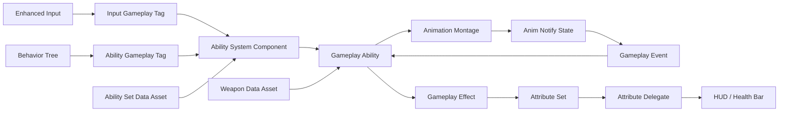

# DEEP DARK SOULS

> Unreal Engine 5와 Gameplay Ability System을 활용한 3인칭 액션 RPG 전투 게임

<p align="center">
 
</p>

## 프로젝트 소개

Deep Dark Soul은 **GAS 기반 플레이어 전투 시스템과 AI Perception 기반 적 AI 구현**을 목표로 제작한 3인칭 액션 RPG 프로젝트입니다.

공격, 회피, 회복, 피격, 사망 등의 행동을 Gameplay Ability로 구성했으며, 플레이어와 몬스터가 공통 Ability를 재사용할 수 있도록 설계했습니다.

무기별 공격 정보와 캐릭터별 Ability 구성을 Data Asset으로 분리하여, 코드 수정 없이 몽타주, 공격 범위, 적용 Effect 및 Ability 구성을 변경할 수 있도록 구현했습니다.

## 개발 정보

| 항목 | 내용 |
|---|---|
| 개발 인원 | 1인 |
| 개발 기간 | 2026.08.18 ~ 2026.09.03 |
| 엔진 | Unreal Engine 5.7 |
| 언어 | C++ / Blueprint |
| 장르 | 소울라이크 |
| 개발 환경 | Visual Studio 2022 |
| 영상 | [YouTube 영상](영상 링크) |

## 기술 스택

- Unreal Engine 5.7
- C++
- Blueprint
- Gameplay Ability System
- Gameplay Tags / Gameplay Effects / Gameplay Events
- Enhanced Input
- Behavior Tree / Blackboard
- AI Perception
- Environment Query System
- Animation Montage / AnimNotifyState
- UMG / Slate
- Niagara

## 핵심 목표

- Gameplay Ability System을 활용한 확장 가능한 전투 구조
- 플레이어와 AI가 공유할 수 있는 Ability 설계
- Data Asset 기반 무기 및 Ability 구성
- AI Perception, Behavior Tree, EQS를 연계한 전투 AI
- Gameplay Event를 이용한 애니메이션과 공격 판정 동기화
- 컴포넌트와 델리게이트를 이용한 역할 분리


## 주요 기능

### GAS 기반 전투 시스템

공격, 회피, 회복, 피격, 사망을 Gameplay Ability로 구현했습니다.

Gameplay Effect를 통해 다음 상태와 수치를 관리합니다.

- 체력 및 스태미나
- 공격 피해
- 회피 스태미나 비용
- Ability 쿨타임
- 무적 상태
- 피격 및 사망 상태

Gameplay Tag를 사용하여 행동 실행 조건과 상태를 표현합니다.

```text
Input.Attack
Input.Dodge
Input.Heal

Event.Attack.Trace
Event.Attack.Combo.Open
Event.Attack.Combo.Close
Event.HitReact
Event.Death

State.HitReact
State.Invincible
State.Dead

Cooldown.Attack
Cooldown.Boss.Charge
Cooldown.Boss.Area
```

### Data Asset 기반 전투 구성

캐릭터의 전투 설정을 코드에서 분리하고 에디터에서 조정할 수 있도록 구성했습니다.

#### Ability Set

캐릭터가 기본으로 보유할 Ability와 입력 태그를 설정합니다.

```text
Ability Class
Ability Level
Activation Tag
```

Player, Monster, Boss는 서로 다른 Ability Set을 사용할 수 있으며, 동일한 C++ Ability를 공유할 수 있습니다.

#### Weapon Data

무기별 공격 정보를 하나의 데이터로 관리합니다.

```text
Weapon Mesh
Attach Socket
Attack Montage
Trace Start/End Socket
Trace Radius
Target Gameplay Effects
HitReact Event Tag
```

공통 Attack Ability가 현재 장착한 Weapon Data를 읽어 공격하기 때문에, 무기별 공격 클래스를 반복해서 구현하지 않아도 됩니다.

### Gameplay Event 기반 공격 판정

애니메이션의 특정 프레임과 실제 공격 판정을 동기화하기 위해 AnimNotifyState와 Gameplay Event를 사용했습니다.

```text
공격 Ability 실행
→ 무기 데이터에서 몽타주 조회
→ 공격 몽타주 재생
→ AnimNotifyState에서 Trace Event 전달
→ Ability가 무기 소켓 기반 Sweep Trace 실행
→ 대상 ASC에 Gameplay Effect 적용
→ 대상에게 HitReact Event 전달
```

공격 판정 시점이 코드의 고정된 시간에 의존하지 않기 때문에, 몽타주가 변경되어도 Notify 위치만 조정하여 대응할 수 있습니다.

### 콤보 공격

각 콤보 공격은 서로 다른 몽타주와 공격 판정 데이터를 사용할 수 있습니다.

```text
공격 입력
→ 1타 Ability 실행
→ Combo Window Open
→ 추가 입력 저장
→ 다음 콤보 몽타주로 전환
→ 콤보별 Trace 및 Effect 적용
```

콤보 전환 시 기존 Montage Task의 델리게이트를 제거하고 새로운 Task를 생성하여, 이전 몽타주의 종료 이벤트가 현재 Ability를 잘못 종료하지 않도록 처리했습니다.

### AI 전투 시스템

AI Perception, Blackboard, Behavior Tree, EQS를 연계하여 적 AI를 구성했습니다.

#### AI Perception

- Sight를 이용한 플레이어 감지
- Damage Sense를 이용한 피격 대상 인식
- 감지한 대상을 Blackboard Target으로 전달
- Target을 기준으로 거리 및 전투 상태 계산

#### Behavior Tree

AI 상태를 다음과 같이 분리했습니다.

```text
Patrol
Chase
Combat
HitReact
Dead
```

BT Service는 ASC의 Gameplay Tag와 타깃 거리를 읽어 Blackboard 상태를 갱신합니다.

일반 몬스터는 추적과 근접 공격을 수행하며, 보스는 거리와 쿨타임에 따라 다음 패턴을 선택합니다.

- 일반 콤보 공격
- 예고 범위 공격
- 돌진 공격
- 공격 대기 중 측면 이동

#### GAS와 Behavior Tree 연동

커스텀 BT Task가 Gameplay Tag로 Ability를 실행하고, `OnAbilityEnded` 델리게이트를 통해 실제 종료까지 기다리도록 구현했습니다.

```text
Behavior Tree Task 실행
→ Dynamic Ability Tag로 Ability 검색
→ Ability 활성화
→ BT Task는 InProgress 유지
→ Ability 종료 이벤트 수신
→ BT Task 종료
```

이를 통해 AI가 공격 명령만 전달하고 즉시 다음 노드로 넘어가는 문제를 방지했습니다.

### 인벤토리 및 무기 교체

- 월드에 배치된 무기 획득
- 40칸 고정 인벤토리
- 슬롯 클릭을 통한 무기 장착
- 기존 장착 무기와 인벤토리 무기 교환
- 장착 무기 메시와 HUD 정보 갱신
- 델리게이트 기반 인벤토리 UI 갱신

Inventory Component를 PlayerState에 배치하여 플레이어 Pawn이 재생성되어도 인벤토리와 장착 정보를 유지하도록 구성했습니다.

### 반응형 UI

ASC의 Attribute 변경 델리게이트를 이용해 UI를 갱신합니다.

- 플레이어 체력 및 스태미나
- 회복 Ability 쿨타임
- 몬스터 머리 위 체력바
- 보스전 전용 체력바
- 현재 장착 무기
- 인벤토리 슬롯

매 프레임 Attribute를 직접 조회하는 대신 값이 변경되는 시점에 UI가 반응하도록 구성했습니다.

## 주요 트러블슈팅

### 몽타주 종료 경계에서 Ability가 남는 문제

#### 문제

공격 몽타주가 끝나기 직전에 피격되면 Attack Ability가 종료되지 않고 활성 상태로 남아, 이후 공격 입력이 동작하지 않는 문제가 발생했습니다.

일반적인 공격 중 피격에서는 발생하지 않고 Blend Out 경계에서만 발생해 재현 조건을 특정하기 어려웠습니다.

#### 원인

Attack Ability가 다음 Montage Task 이벤트만 종료 조건으로 처리하고 있었습니다.

```text
OnCompleted
OnInterrupted
OnCancelled
```

몽타주가 정상 Blend Out에 진입한 직후 피격 몽타주로 교체되면 `OnCompleted`와 `OnInterrupted` 사이의 종료 경로가 누락될 수 있었습니다.

#### 해결

- `OnBlendOut`을 Ability 종료 경로에 추가
- 모든 종료 콜백에 `IsActive()` 검사 적용
- 다수의 종료 콜백이 발생해도 한 번만 종료되도록 처리
- 콤보 전환 전 기존 Montage Task 델리게이트 해제
- Ability 종료 시 Gameplay Event Task와 Montage Task 정리

#### 결과

- 공격 종료 직전 피격 상황에서도 Ability 정상 종료
- 피격 후 공격 및 콤보 재실행 가능
- 콤보 전환과 실제 공격 종료 생명주기 분리
- 애니메이션 상태와 Gameplay Ability 상태의 동기화 안정성 향상

### AI Ability 종료 대기 문제

#### 문제

Behavior Tree Task가 Ability를 실행한 직후 종료되면 AI가 공격 애니메이션 도중 다음 행동으로 넘어가는 문제가 있었습니다.

#### 해결

Ability 활성화 시 사용된 `AbilitySpecHandle`을 저장하고, ASC의 `OnAbilityEnded` 델리게이트에서 동일한 Ability의 종료 여부를 확인했습니다.

Behavior Tree가 Abort되면 실행 중인 Ability도 함께 취소하고 델리게이트를 해제하도록 구성했습니다.

#### 결과

- AI 행동과 Ability 실행 시간 동기화
- 피격 및 사망으로 공격이 취소되는 상황 대응
- 일반 공격과 보스 패턴에서 동일한 BT Task 재사용

## 시스템 구조



## 클래스 구조

```text
AFLCharacterBase
├─ AbilitySystemComponent
├─ FLAttributeSet
├─ FLCombatComponent
└─ WeaponMeshComponent

AFLCharacterPlayer
├─ Enhanced Input
└─ Player HUD

AFLCharacterMonster
├─ AIController
├─ AI Perception
└─ World Health Bar

AFLCharacterBoss
├─ Boss Ability Set
├─ Area / Charge Ability
└─ Boss Health Bar

AFLPlayerState
└─ FLInventoryComponent
```

## 프로젝트에서 배운 점

- 비동기 Gameplay Task의 생명주기와 종료 경로 관리
- 애니메이션과 Gameplay 상태 사이의 동기화
- Gameplay Tag를 이용한 시스템 간 느슨한 연결
- Data Asset을 통한 코드와 콘텐츠 데이터 분리
- 컴포넌트 및 델리게이트 기반 책임 분리
- 플레이어와 AI가 공유할 수 있는 Ability 설계
- 타이밍 의존적인 전투 버그의 재현 및 분석

## 향후 개선 사항

- 적대 진영 기반 공격 대상 필터링
- Weapon Data 유효성 검증 강화
- AI 타깃 기억 및 해제 정책 개선
- UI 델리게이트 재바인딩 및 수명 관리 강화
- Native Gameplay Tag를 통한 태그 중앙화
- 자동화 테스트 및 Data Validation 추가

## 사용 애셋

프로젝트에 사용된 외부 애셋과 라이선스를 이곳에 작성합니다.

- Character Asset:
- Animation Asset:
- VFX Asset:
- Sound Asset:
- Environment Asset:
